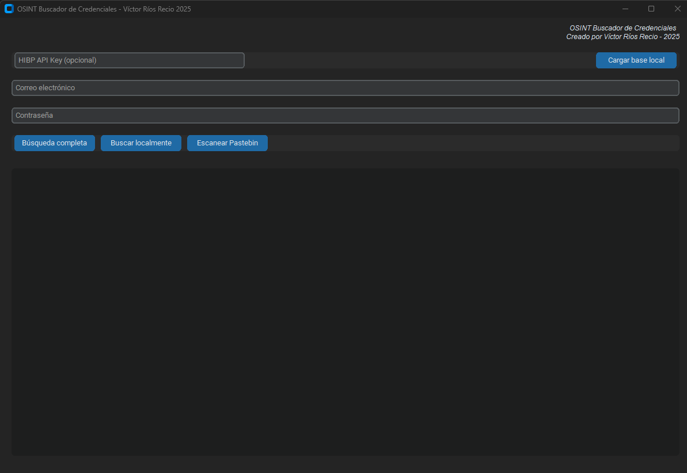

# OSINT Buscador de Credenciales



Herramienta avanzada de OSINT para verificación de credenciales comprometidas, desarrollada por **Víctor Ríos Recio - 2025**.

---

## Características Principales

- 🔍 **Búsqueda en múltiples fuentes**:
  - API de Have I Been Pwned (con/sin API key).
  - Bases de datos locales (CSV, SQL, TXT).
  - Contenido público en Pastebin.
- 🔒 **Verificación de seguridad**:
  - Emails en fugas conocidas.
  - Contraseñas comprometidas.
  - Contraseñas débiles (lista RockYou).
- 💻 **Interfaz moderna**:
  - Diseño oscuro/material.
  - Resultados con colores e iconos.
  - Bloqueo de edición en resultados.
- ⚙️ **Funcionalidades avanzadas**:
  - Carga de bases de datos locales.
  - Búsqueda combinada email + contraseña.
  - Detección de patrones en código SQL.
  - Scraping ético en Pastebin.

---

## Requisitos

- **Python 3.8+**.
- **Sistema operativo**: Windows, macOS o Linux.
- **Conexión a internet** (para búsquedas online).

---

## Instalación

1. Clona el repositorio usando el siguiente comando:  
   `git clone https://github.com/vctorr1/osint.git`  
   Luego, accede al directorio del proyecto:  
   `cd osint`

2. Instala las dependencias necesarias:  
   `pip install -r requirements.txt`

### Dependencias principales:
- `customtkinter` (Interfaz gráfica).
- `requests` (Peticiones HTTP).
- `beautifulsoup4` (Web scraping).
- `hashlib` (Hash de contraseñas).

---

## Instrucciones de uso

1. Descarga el archivo `main.exe` desde la sección de archivos.
2. Ejecuta el archivo (doble clic).
3. Asegúrate de tener Python 3.8+ instalado si es necesario.

**Nota**: Si el programa requiere bases de datos locales, descárgalas y colócalas en la misma carpeta que el ejecutable.

## Uso


### Búsqueda Básica
1. Introduce un email o contraseña.
2. Selecciona el modo de búsqueda:
   - 🔎 **Búsqueda completa**: Verifica en HIBP y bases locales.
   - 💾 **Buscar localmente**: Solo en bases cargadas.
   - 📋 **Escanear Pastebin**: Busca en contenido público.

### Carga de Bases Locales
1. Haz clic en **"Cargar base local"**.
2. Selecciona un archivo (CSV, SQL o TXT).
3. Formatos soportados:
   - **CSV**: Columnas "email" y/o "password".
   - **SQL**: Sentencias INSERT con datos.
   - **TXT**: Lista de emails o contraseñas.

---

## Ejemplo de Resultados

- ✅ Email no encontrado en fugas conocidas.
- ❌ Contraseña comprometida en 124 fugas.
- ⚠️ Posible fuga en Pastebin:
  - Título: Credenciales 2023.
  - Enlace: https://pastebin.com/abc123.

---

## Configuración Opcional

1. **API Key de HIBP**:
   - Regístrate en [HIBP API](https://haveibeenpwned.com/API/Key).
   - Ingresa la clave en el campo correspondiente.
   - Permite hasta 10,000 consultas/mes.

2. **Bases de datos recomendadas**:
   - [Colecciones HIBP](https://haveibeenpwned.com/Passwords).
   - [Lista RockYou](https://github.com/brannondorsey/naive-hashcat).

---

## Consideraciones Legales

- ⚠️ **Usar solo con propósitos éticos**.
- Respetar `robots.txt` de los sitios.
- No realizar scraping agresivo.
- Obtener bases de datos legalmente.

---

## Licencia

```plaintext
MIT License
Copyright (c) 2025 Víctor Ríos Recio
